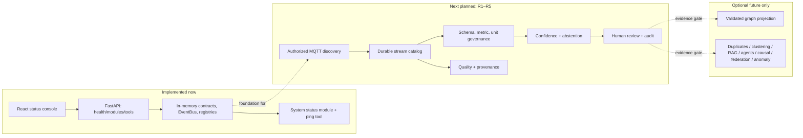

# Component Status Map

```mermaid
flowchart LR
  subgraph Now["Implemented now"]
    API["FastAPI: health/modules/tools"] --> Core["In-memory contracts, EventBus, registries"]
    UI["React status console"] --> API
    Core --> Status["System status module + ping tool"]
  end
  subgraph Next["Next planned: R1–R5"]
    MQTT["Authorized MQTT discovery"] --> Catalog["Durable stream catalog"]
    Catalog --> Gov["Schema, metric, unit governance"] --> Classify["Confidence + abstention"] --> Review["Human review + audit"]
    Catalog --> Quality["Quality + provenance"]
  end
  subgraph Optional["Optional future only"]
    Graph["Validated graph projection"]
    Research["Duplicates / clustering / RAG / agents / causal / federation / anomaly"]
  end
  Core -. "foundation for" .-> MQTT
  Review -. "evidence gate" .-> Graph
  Review -. "evidence gate" .-> Research
```

Dashed arrows show sequencing, not deployed integrations.
