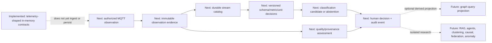

# Data Flow Status Map

```mermaid
flowchart LR
  A["Implemented: telemetry-shaped in-memory contracts"]
  B["Next: authorized MQTT observation"] --> C["Next: immutable observation evidence"] --> D["Next: durable stream catalog"]
  D --> E["Next: versioned schema/metric/unit decisions"]
  E --> F["Next: classification candidate or abstention"] --> G["Next: human decision + audit event"]
  C --> H["Next: quality/provenance assessment"] --> G
  G -. "optional derived projection" .-> I["Future: graph query projection"]
  G -. "isolated research" .-> J["Future: RAG, agents, clustering, causal, federation, anomaly"]
  A -. "does not yet ingest or persist" .-> B
```

Raw evidence, derived assessments, and human decisions must remain separately versioned.
