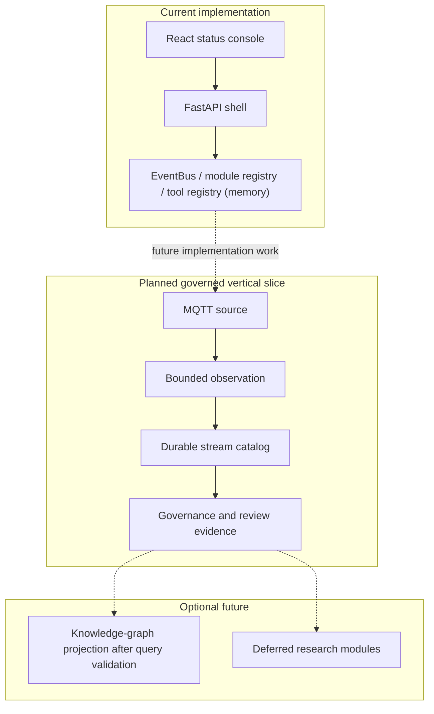

# System Overview

```mermaid
flowchart TB
  subgraph Current["Current implementation"]
    F["FastAPI shell"]
    R["EventBus / module registry / tool registry (memory)"]
    U["React status console"] --> F --> R
  end
  subgraph Planned["Planned governed vertical slice"]
    S["MQTT source"] --> O["Bounded observation"] --> C["Durable stream catalog"]
    C --> D["Governance and review evidence"]
  end
  subgraph Future["Optional future"]
    K["Knowledge-graph projection after query validation"]
    X["Deferred research modules"]
  end
  R -. "future implementation work" .-> S
  D -.-> K
  D -.-> X
```

PostgreSQL, InfluxDB, Mosquitto, and ChromaDB are Compose-provisioned local services only; the current application has no integration with them.
