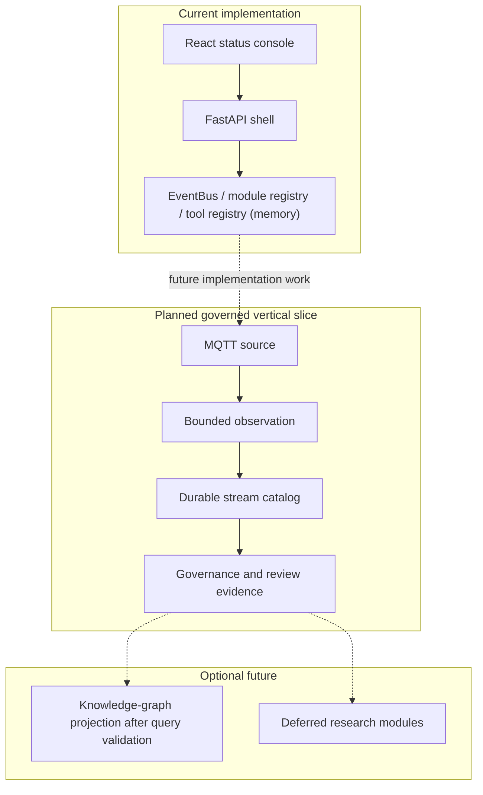

# System Overview

PostgreSQL and Mosquitto support the current R1 slice, and accepted normalized observations are delivered from the PostgreSQL outbox to InfluxDB 2.x. ChromaDB remains Compose-provisioned only and is outside the delivery path.
